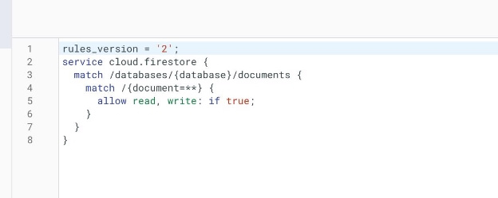

**Flutter web app setup **

15-10-21 Last updated

**─**

**Introduction**

Welcome to **Walfy Admin** documentation & thank you for buying our product. So there are two setup steps here. Admin panel &  App. Both are developed on Flutter. So, You have to install flutter on your computer. You can use Both **Visual Studio Code** &**Android Studio** for Flutter. The steps are the same for both IDE.. We have used Visual Studio Code. So, Our Setup will be based on this IDE.

12

**1. Flutter Installation**

First, You have to install flutter on your computer. To install flutter on your computer, follow the official documentation from Google.

Flutter Official Site : h[ttps://flutter.dev/.](https://flutter.dev/)

You can follow these youtube videos to install flutter also.

1. For Mac: <https://www.youtube.com/watch?v=9GuzMsZQUYs>
1. For Windows: h[ttps://www.youtube.com/watch?v=T9LdScRVhv8](https://www.youtube.com/watch?v=T9LdScRVhv8)

Make sure you have installed the latest stable version of flutter. If everything is okay then you can follow the further steps below.

**2. Admin Panel Setup**

After successfully installing Flutter on your computer, You have to enable Flutter web support. Make sure you have installed the stable channel.

1. **Flutter Web Setup**

From Flutter stable version 2.0.0+, it will support the web. So, If you are already on the latest stable channel of flutter, you don’t have to do anything for the flutter web. **You should run all the commands on your IDE terminal from the project directory.**

1. Open the **source/wallpaper\_admin** folder with your terminal and wait some moment to load the admin project.
1. After that run the following command to clean the whole project. flutter clean
3. After that run the following command to get the required packages. flutter pub get
3. After that run the following command to enable web support for your project. flutter config --enable-web

And then it will enable the web feature for your project. That’s it. Your admin project initialization is complete.

2. **Firebase(Database) Setup for Admin Panel :**
1. We have used the firestore **database** as the backend for this project. First go to the [Firebase Console a](https://firebase.google.com/)nd sign in with your gmail account and go to the console.
1. Create  a project by your app name. And go to the project overview.
1. Click on the **plus icon** and then click on the **web icon**. You will see a popup like the second picture below :

4. Input the name like as **Admin Panel** and fill the checkbox because you need hosting too and  then click on **register app**. After that, Skip the other options by clicking next. (Don’t input custom name for hosting else you need extra setup for this which is not recommended)
5. Now go to the Project settings and in the bottom section click on the **Admin panel** that you have just created.
5. After that click on **CDN** and copy the selected code which is shown in the picture below.

7. Now, go to your admin panel project with your IDE.
7. Go to **web/index.html** file and replace the selected code with your config code (what you have just copied from the firebase console). Look at the picture below:

9. Now go to the **Firebase Console > Project Overview** page and click on **Firestore Database** and create a **database** as test mode.
9. Now, Create a collection as **admin** and create a document as **user type** and create a textfield as **admin password** and use your password as **value**. Just like the picture below (Only the admin section). Try to use a unique password. This will be the password of your admin panel. You can change the password from here anytime. You can also change the password from your admin website.
3. **Database Rules Setup :**

Go to your **firebase console > project overview > database > firestore database > rules** and then edit the rules like this and click publish.

4. **Database Index Setup :**

Now go to the right tab (**Indexes**) of the same page. Click on **Add Index** and then create an index by following the picture below.

After completing this, your index page should look like this :

That’s it. Your database setup is complete.

5. **Other Setup**

\1. Change the **app name**. Go to the **lib/model/config.dart** file and change the app name. You can change the **testing password** too. Make sure the testing password and the password in the database are not the same.

That’s it. Your Admin Setup is complete. You can run the admin app now.

**3.  Run The Admin App**

1. You can run the admin app now running the following command in the terminal. flutter run -d chrome --web-renderer html
1. After running the admin app, Use the password that you have saved in the database before and check if everything is okay or not.

**4.  Upload the Admin App to the Firebase Hosting**

1. You have to upload your site to your firebase hosting. For this, you have to install firebase tools on your IDE. Run this command on the terminal:

It will download firebase tools for you. Or you directly download from here a[nd ](https://nodejs.org/en/)install this manually.

npm install -g firebase-tools

2. After that, You need to login to the firebase console with your google account. To do that, Run:

firebase login

Follow the command prompt and the link in your browser. Accept the permissions by clicking Ok. When you return to your terminal you should see that you are now logged in:

3. Now you have to initialize the firebase. Run this command: firebase init

4. Use the arrow keys to navigate the cursor to Hosting and hit the spacebar to select it, then press enter. Now you will see this screen:

5. Select an existing project by pressing Enter. Use the arrow keys to select the project you have made in the firebase console.
5. Next, enter **build/web** as the public directory and press enter, then enter y (for yes) to select the single page app option:

7. Now Run this command to build the web app.

flutter build web --web-renderer html --release

8. After that, run this command to upload the app to your hosting and wait for some moment.

firebase deploy

That’s it. Your Admin Panel is 100% complete. You will get a url from the terminal and it will be the domain of your admin panel and you can use this domain for further use of the admin panel. You can also get the domain from your **firebase console > your app > hosting page.**

Now, Go for the app setup!

**5. Before the App Setup (Important!!!!!!!!!)**

You have to upload some categories & contents. Otherwise the app will show nothing at all and can cause errors.

***Make sure you have uploaded at least 1 categorie & 5 contents before going to the app setup .***
